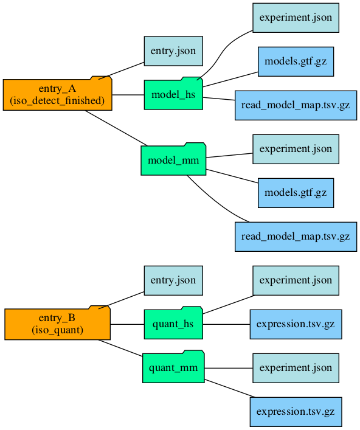

# Submission structure

Submissions to LRGASP target a particular challenge, with two types of
submissions: model and expression. Model submissions are genomic transcript
model predictions, and expression submissions are transcript expression
estimates of a set of submitted models.

A participant may submit two model submissions per challenge and up to two expression submissions per model submission.  The purpose of this limit is to prevent the evaluation process from being overwhelmed by submissions with minor variations. If you need to exceed this limit, please contact [lrgasp-support](mailto:lrgasp-support-group@ucsc.edu).

When a submitter registers for LRGASP, they are assigned a [symbolic identifier](#symbolic-identifiers), called the ``submitter_id``.  Other symbolic submission identifiers assigned by the submitter and must be valid [symbolic identifier](#symbolic-identifiers), as described below.  Model submission identifiers must start with ``mod_`` and expression ones with ``exp_``.

Each submitter is given a file area to upload their results (a mechanism to be determined).  The top-level directory name in that area is the *submitter_id*. Below that are directories for each submission.  Submissions are updated by replacing files, and submissions retracted simply by removing the directory.

This diagram shows the general structure:

## Symbolic identifiers

Various components of the submission system have symbolic identifiers.  These identifiers consist of [ASCII](https://www.wikiwand.com/en/ASCII) upper- and lower-case alphabetic characters, numbers, and underscores.  They must not begin with numbers.  In some cases, specific prefixes are required.

## Feature identifiers

Feature identifiers (transcripts and genes) may contain any combination of printing, non-whitespace characters [ASCII](https://www.wikiwand.com/en/ASCII).  It is highly read.  This requirement is more restrictive than allowed by GFF3.
